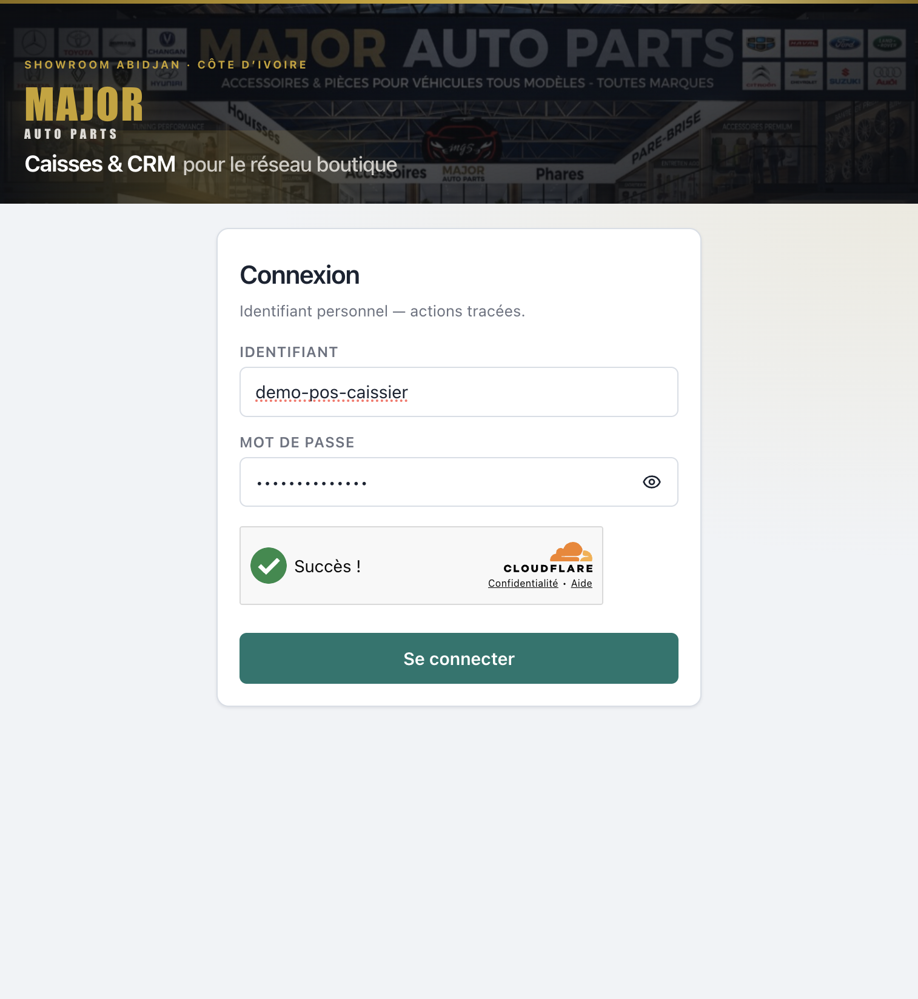
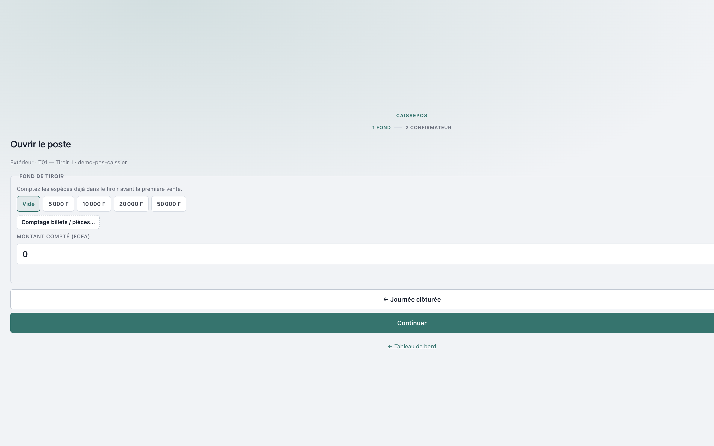
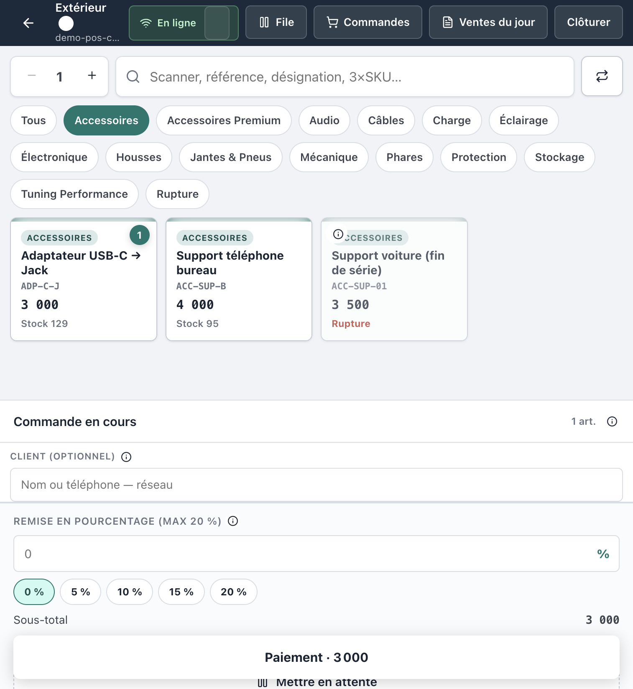
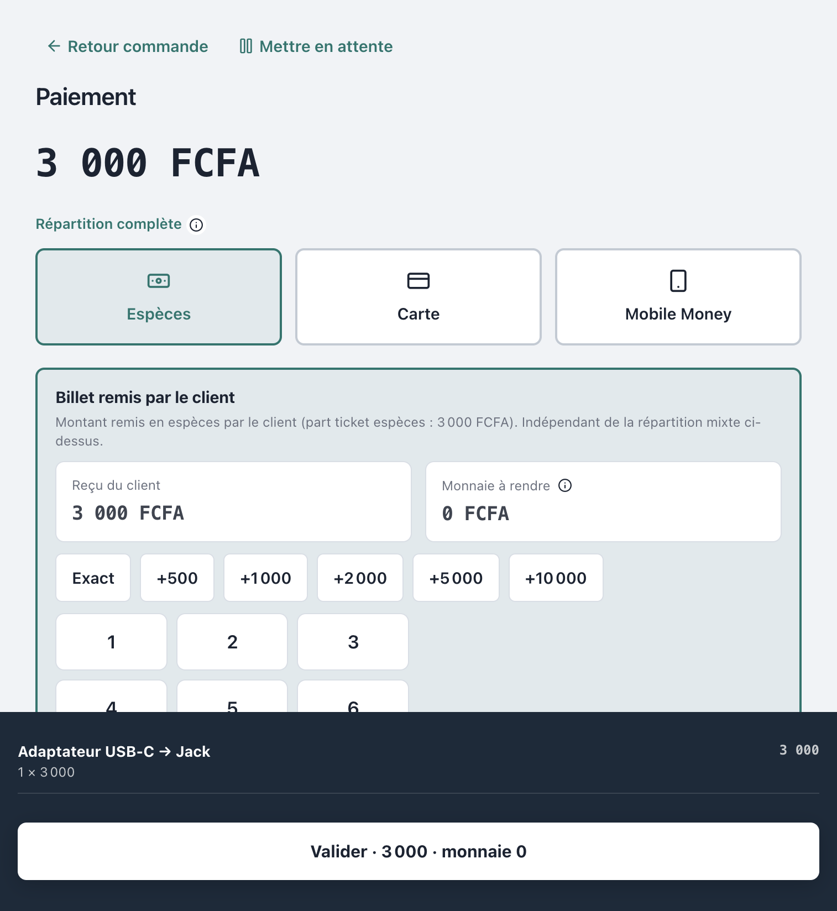
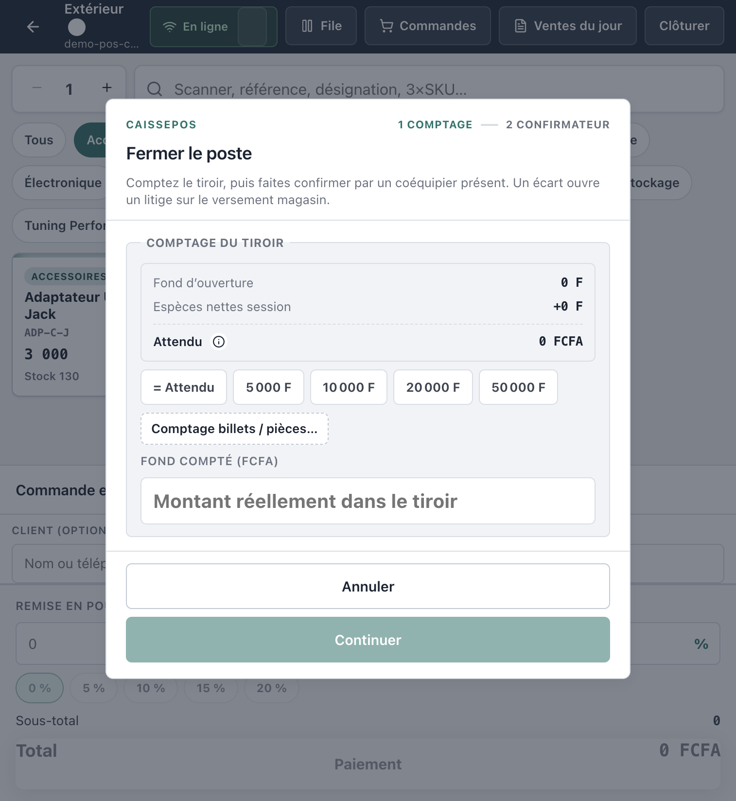
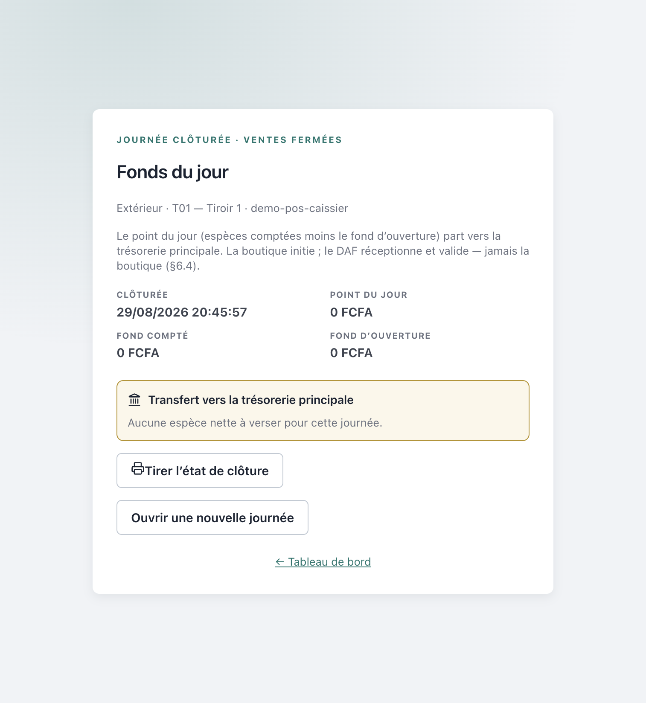
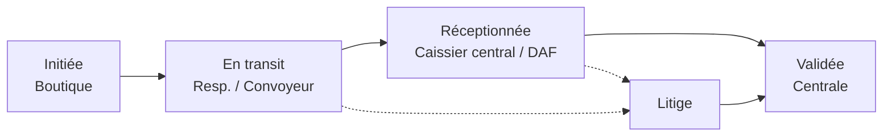

# Manuel d’utilisation — Caisse boutique (POS)

**Progiciel Caisses & CRM — MAJOR AUTO PARTS**  
Public : **Caissier(ère) boutique** et **Responsable boutique**  
Périmètre : ouverture de session → ventes → clôture → transfert vers la trésorerie principale (caisse centrale)

> Captures réelles depuis l’application en production (`crm.majorautoparts.shop`, compte démo POS). Les libellés correspondent exactement à CaissePOS.

---

## Table des matières

1. [Avant de commencer](#1-avant-de-commencer)
2. [Connexion](#2-connexion)
3. [Ouvrir le poste (fond de tiroir)](#3-ouvrir-le-poste-fond-de-tiroir)
4. [Encaisser une vente](#4-encaisser-une-vente)
5. [Clôturer la journée](#5-clôturer-la-journée)
6. [Transfert vers la caisse principale](#6-transfert-vers-la-caisse-principale)
7. [Circuit des fonds (statuts)](#7-circuit-des-fonds-statuts)
8. [Ce que la boutique ne peut jamais faire](#8-ce-que-la-boutique-ne-peut-jamais-faire)
9. [Incidents fréquents](#9-incidents-fréquents)
10. [Rappel des comptes démo (local / staging)](#10-rappel-des-comptes-démo-local--staging)

---

## 1. Avant de commencer

### Rôles concernés

| Rôle | Accès principal | Peut faire |
|------|-----------------|------------|
| **Caissier(ère) boutique** | Point de vente (`/pos`) | Encaisser, clôturer, **initier** le versement du jour |
| **Responsable boutique** | Dashboard + POS | Idem + **mettre en transit** le versement |

### Matériel recommandé

- Navigateur à jour (Chrome / Edge / Safari)
- Connexion Internet (mode hors-ligne limité aux ventes en file d’attente)
- Imprimante ticket (si utilisée en boutique)
- Un **confirmateur** (coéquipier ou responsable) pour l’ouverture et la clôture

### Règle d’or (séparation des tâches)

Une caisse boutique **encaisser** et **initier** le versement.  
Elle **ne réceptionne jamais** et **ne valide jamais** un versement à la centrale.  
Seuls le **Caissier central** et le **DAF** réceptionnent / valident.

---

## 2. Connexion

1. Ouvrir l’adresse CRM / POS de votre environnement (ex. `https://pos.majorautoparts.shop` ou `https://crm.majorautoparts.shop`).
2. Saisir votre **Identifiant** et votre **Mot de passe**.
3. Cliquer sur **Se connecter**.
4. En production, valider le widget **Cloudflare Turnstile** (anti-bots) s’il s’affiche.



*Figure 1 — Connexion CaissePOS*

Après connexion, le caissier arrive sur le **Point de vente**. Le responsable peut aussi ouvrir **Point de vente** depuis le menu **Ventes**.

---

## 3. Ouvrir le poste (fond de tiroir)

Sans session ouverte, aucune vente n’est possible.

### Étape A — Fond de tiroir

1. Sur l’écran **Ouvrir le poste**, choisir le **tiroir** si plusieurs sont proposés.
2. Compter les espèces déjà présentes dans le tiroir.
3. Saisir le **Montant compté (FCFA)** (ou utiliser les pastilles rapides : Vide, montants types).
4. Cliquer sur **Continuer**.



*Figure 2 — Ouverture : comptage du fond*

### Étape B — Confirmateur

1. Sélectionner le **confirmateur présent** (responsable magasin ou autre caissier habilité).
2. Saisir le **mot de passe** du confirmateur.
3. Cliquer sur **Démarrer les ventes**.

La session passe à l’état **OUVERTE**. Vous pouvez encaisser.

> Le fond d’ouverture servira de référence au moment de la clôture (calcul de l’attendu).

---

## 4. Encaisser une vente

### 4.1 Composer le panier

1. Scanner le code-barres ou rechercher l’article (référence, désignation, SKU).
2. Ajuster les quantités.
3. Appliquer une **remise** si besoin (plafond usuel **20 %** ; au-delà, dérogation chef de caisse).
4. Vérifier **Sous-total**, **Remise**, **Total**.
5. Actions utiles :
   - **Mettre en attente** — park du ticket
   - **Vider le panier**
   - **Paiement · {montant}** — passer à l’encaissement



*Figure 3 — Composition du panier*

Barre supérieure utile : **File**, **Commandes**, **Ventes du jour**, **Clôturer**.  
Indicateur **En ligne** / **Hors ligne** : hors ligne, les ventes partent en file et se synchronisent au retour réseau.

### 4.2 Paiement

1. Choisir un ou plusieurs modes : **Espèces**, **Carte**, **Mobile Money**.
2. En espèces :
   - Saisir le **reçu du client (billets)**
   - Vérifier la **monnaie à rendre**
3. Client : laisser **Client anonyme** ou rattacher une fiche CRM (optionnel — la vente anonyme est toujours autorisée).
4. Cliquer sur **Valider · {total}**.



*Figure 4 — Paiement*

### 4.3 Ticket

- Le ticket s’affiche (et s’imprime si l’imprimante est configurée).
- Boutons : **Réimprimer**, **Nouvelle commande**.
- Reprendre les ventes pour le reste de la journée.

---

## 5. Clôturer la journée

Quand le magasin ferme (ou en fin de vacation) :

1. Vider ou finaliser le panier en cours.
2. Cliquer sur **Clôturer** (indisponible s’il reste des ventes hors-ligne non synchronisées ou une file bloquante).
3. Dans **Fermer le poste** :

### Étape 1 — Comptage

- Relire **Fond d’ouverture**, **Espèces nettes session**, **Attendu**.
- Saisir le **Fond compté (FCFA)** réel du tiroir.
- Message attendu si tout est juste : *Tiroir juste — aucun écart*.
- Un **écart** peut déclencher un **litige** sur le versement magasin.

### Étape 2 — Confirmateur

- Mot de passe du confirmateur.
- Cliquer sur **Clôturer**.



*Figure 5 — Fermeture / comptage*

### Ce que fait le système à la clôture

1. Ferme la session de caisse.
2. Enregistre les espèces sur le tiroir.
3. Transfert interne **tiroir → caisse magasin**.
4. Si **aucun écart** et un point du jour > 0 : peut **initier automatiquement** une sortie de fonds magasin → centrale au statut **Initiée**.

Vous arrivez ensuite sur l’écran **Fonds du jour** (*Journée clôturée · ventes fermées*).

---

## 6. Transfert vers la caisse principale

Objectif : faire partir les fonds du magasin vers la **trésorerie principale** (caisse centrale).

### Depuis l’écran « Fonds du jour » (recommandé)

1. Section **Transfert vers la trésorerie principale**.
2. Suivre le circuit affiché :
   - Transfert initié  
   - En transit  
   - Réception DAF / Caissier central  
   - Validée  
3. Si le versement n’est pas encore initié : cliquer sur **Transférer vers la trésorerie principale**.
4. Statut attendu côté boutique : **Initiée — à mettre en transit**.
5. Le **Responsable boutique** (ou le convoyeur selon procédure) clique sur **Mettre en transit**.
6. Options utiles :
   - **Voir le bordereau**
   - **Tirer l’état de clôture**
   - **Ouvrir une nouvelle journée** (nouvelle session le lendemain)



*Figure 6 — Fonds du jour et transfert*

### Depuis le menu Trésorerie (manuel)

1. Menu **Trésorerie** → **Transactions** (ou **Bordereaux**).
2. **Nouveau versement** → renseigner le montant / motif → **Initier le versement**.
3. Sur la fiche transaction : **Passer en transit** / **Mettre en transit**.

> Après **En transit**, le travail boutique s’arrête pour ce versement. La suite est exclusivement **Centrale / DAF**.

---

## 7. Circuit des fonds (statuts)

Machine à états (§6.4 du cahier des charges) :

```
Initiée → En transit → Réceptionnée → Validée
                   ↘ Litige (bloqué jusqu’à régularisation)
```

| Statut | Qui agit | Signification |
|--------|----------|---------------|
| **Initiée** | Caissier / Responsable boutique | Demande de sortie créée |
| **En transit** | Responsable boutique / Convoyeur | Fonds en route vers la centrale |
| **Réceptionnée** | **Caissier central / DAF uniquement** | Arrivée physique / saisie centrale |
| **Validée** | **Caissier central / DAF uniquement** | Rapprochement sans écart |
| **Litige** | Contrôle interne / DAF | Écart à régulariser |

### Schéma



---

## 8. Ce que la boutique ne peut jamais faire

| Action | Boutique | Centrale / DAF |
|--------|----------|----------------|
| Encaisser une vente | Oui | — |
| Initier un versement | Oui | — |
| Mettre en transit | Responsable / Convoyeur | — |
| **Réceptionner** un versement | **Non** | Oui |
| **Valider / rapprocher** | **Non** | Oui |
| Régulariser un litige magasin→centrale | **Non** | Contrôle interne / DAF |

Toute tentative d’appel API hors rôle est **refusée (403)** et journalisée.

---

## 9. Incidents fréquents

| Symptôme | Que faire |
|----------|-----------|
| Bouton **Clôturer** grisé | Synchroniser les ventes hors-ligne ; vider / finaliser la file |
| Écart à la clôture | Recompter ; l’écart peut créer un **litige** — prévenir le responsable / contrôle |
| « Compte verrouillé » à la connexion | Attendre 15 min après 5 échecs, ou faire débloquer par l’admin |
| Widget anti-bot (Turnstile) | Cocher / attendre la validation Cloudflare avant **Se connecter** |
| Pas d’imprimante | Utiliser **Réimprimer** plus tard ou l’état de clôture PDF |
| Versement déjà **Initiée** | Ne pas ré-initier : passer à **Mettre en transit** |

---

## 10. Rappel des comptes démo (local / staging)

Mot de passe seed : `MotDePasse!123`  
*(jamais pour la production live)*

| Identifiant | Rôle | Usage |
|-------------|------|--------|
| `demo-pos-caissier` | Caissier boutique | Encaisser / clôturer / initier |
| `demo-pos-temoin` | Responsable boutique | Confirmateur + transit |
| `demo-central` | Caissier central | Réception / validation (**pas boutique**) |
| `demo-daf` | DAF | Validation niveau 2 |

---

## Checklist de fin de journée (boutique)

- [ ] Toutes les ventes de la session sont encaissées  
- [ ] File hors-ligne vide / synchronisée  
- [ ] **Clôturer** avec comptage + confirmateur  
- [ ] Écart = 0 (sinon signaler)  
- [ ] Versement **Initiée** (auto ou bouton **Transférer…**)  
- [ ] Responsable : **Mettre en transit**  
- [ ] Conserver / imprimer l’**état de clôture**  
- [ ] **Ne pas** tenter de réceptionner ni valider à la centrale  

---

*Document couvrant le workflow POS §6.3 et la machine à états des versements §6.4 — séparation des tâches §6.2.*  
*MAJOR AUTO PARTS · CaissePOS*
