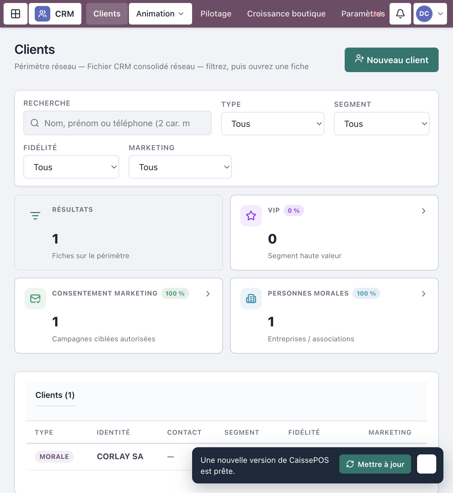
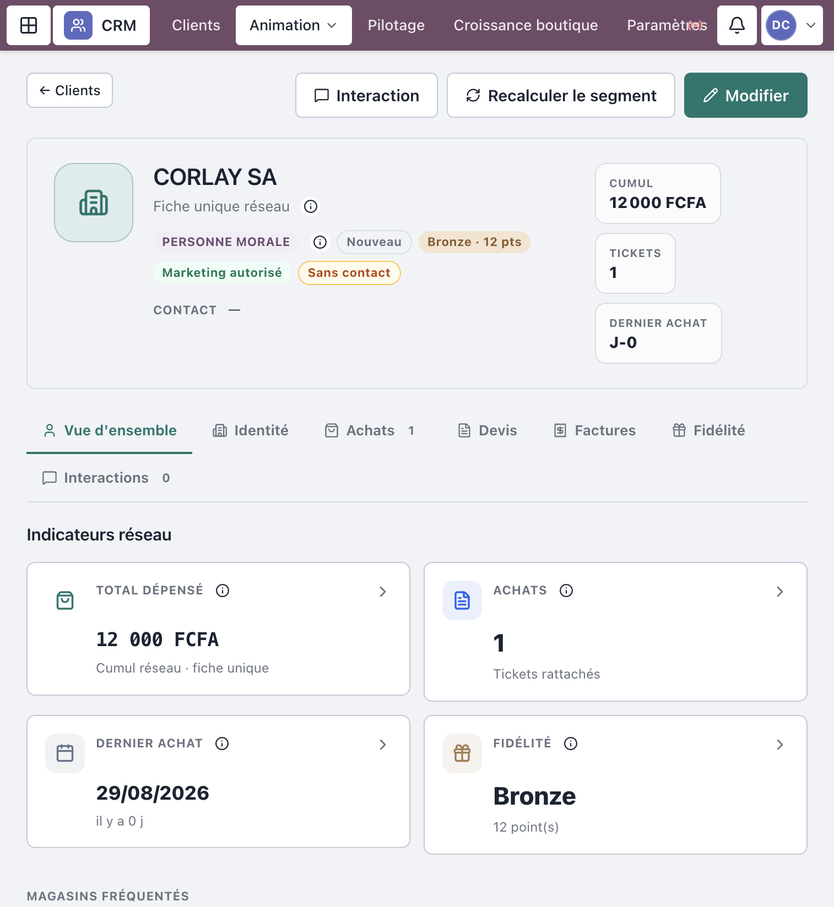
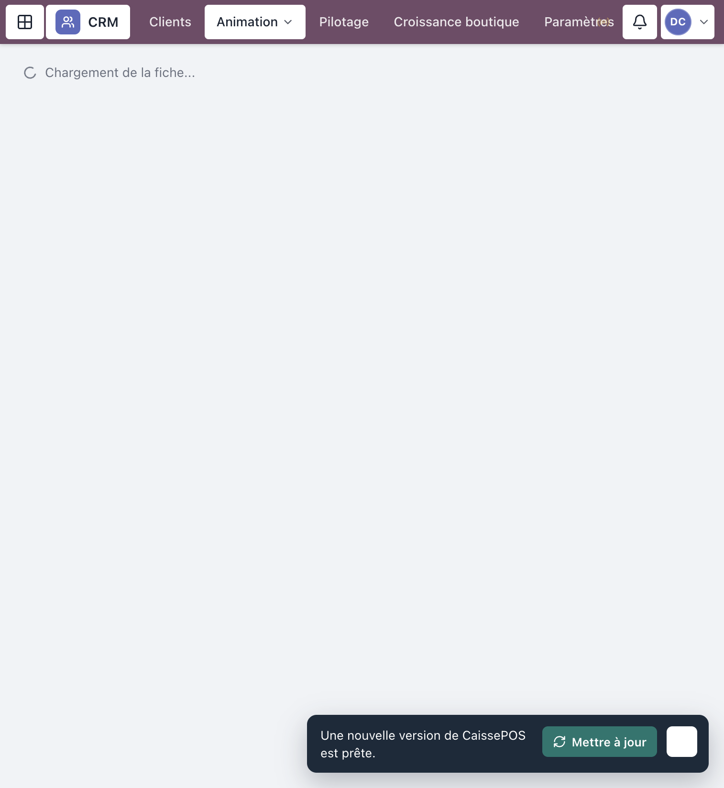
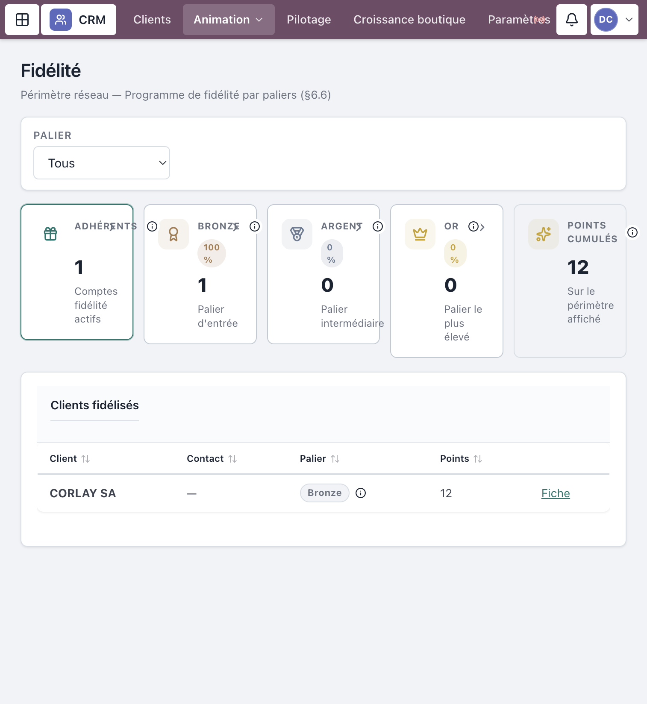
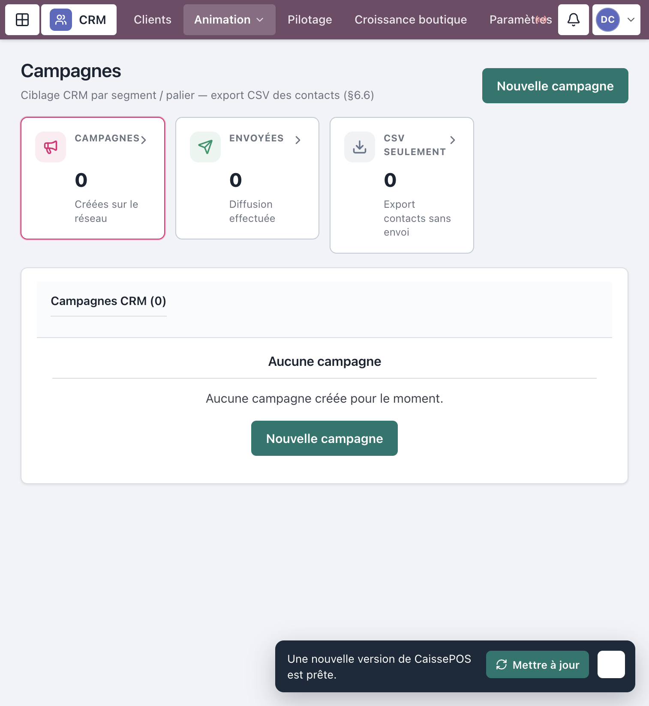

# Manuel d’utilisation — Module CRM

**Progiciel Caisses & CRM — MAJOR AUTO PARTS**  
Public : **Responsable commercial / CRM** (et lecture Direction / DAF selon droits)  
Périmètre : fiches clients, interactions, fidélité, segmentation, campagnes, pilotage (§6.6)

> Captures réelles depuis l’application en production (`crm.majorautoparts.shop`, compte `demo-crm`). Les libellés correspondent exactement à l’interface.

---

## Table des matières

1. [Avant de commencer](#1-avant-de-commencer)
2. [Connexion](#2-connexion)
3. [Liste des clients](#3-liste-des-clients)
4. [Fiche client](#4-fiche-client)
5. [Interactions](#5-interactions)
6. [Fidélité et segmentation](#6-fidélité-et-segmentation)
7. [Campagnes](#7-campagnes)
8. [Pilotage et paramètres](#8-pilotage-et-paramètres)
9. [Ce que le CRM ne gère pas](#9-ce-que-le-crm-ne-gère-pas)
10. [Incidents fréquents](#10-incidents-fréquents)
11. [Comptes démo](#11-comptes-démo)

---

## 1. Avant de commencer

### Rôles concernés

| Rôle | Peut faire |
|------|------------|
| **Responsable CRM** | Module complet : créer/modifier, fidélité, campagnes, paramètres |
| **Caissier / Resp. boutique** | Créer un client + tracer une interaction (pas d’admin campagnes) |
| **DG / DAF / Central / Contrôle** | Lecture (pilotage / campagnes selon profil) |

### Règles métier clés (§6.6)

- Fiche client **unique** et consolidée réseau (historique visible depuis n’importe quelle boutique).
- Rattachement client à une vente POS = **optionnel** — la vente anonyme reste toujours possible.
- Segmentation et paliers de fidélité sont **paramétrables**.

---

## 2. Connexion

1. Ouvrir `https://crm.majorautoparts.shop`.
2. Se connecter avec un compte CRM (ex. `demo-crm` en démo).
3. Accueil : **Clients** (`/clients`).

*Figure 1 — Connexion*

---

## 3. Liste des clients

Menu **Clients** (`/clients`).

1. Filtrer par **Segment** (Nouveau / Régulier / VIP) si besoin.
2. Rechercher par nom ou téléphone.
3. Cliquer une ligne pour ouvrir la fiche.
4. **Nouveau client** → renseigner le type (physique / morale) → **Créer le client**.

*Figure 2 — Liste des clients*

---

## 4. Fiche client

Route : `/clients/:clientId`.

Onglets typiques : **Vue d’ensemble** · **Identité** · **Achats** · **Devis** · **Factures** · **Fidélité** · **Interactions**.

Actions fréquentes :

- **Modifier** / **Enregistrer** (Responsable CRM)
- **Recalculer le segment**
- **Interaction** (raccourci saisie)
- Fidélité : **Créditer des points** / **Créditer** (CRM seul)

*Figure 3 — Fiche client*

---

## 5. Interactions

Menu **Animation** → **Interactions** (`/clients/interactions`), ou depuis la fiche.

1. Choisir le client (si pas déjà sur la fiche).
2. Sélectionner le **canal** et le motif / commentaire.
3. **Enregistrer** / **Enregistrer l’interaction**.

Le journal consolide l’historique réseau.

*Figure 4 — Interactions CRM*

---

## 6. Fidélité et segmentation

### Fidélité

Menu **Animation** → **Fidélité** (`/clients/fidelite`).

- Filtrer par **Palier** : Bronze / Argent / Or.
- Les points peuvent aussi être crédités depuis la fiche client.

### Segmentation

Menu **Animation** → **Segmentation** (`/clients/segmentation`).

- Vue des segments paramétrés.
- Action ligne : **Recalculer**.

*Figure 5 — Fidélité ou segmentation*

---

## 7. Campagnes

Menu **Animation** → **Campagnes** (`/campagnes`).

1. **Nouvelle campagne** → définir segment / palier / canal.
2. **Créer la campagne**.
3. **Voir les contacts ciblés**.
4. **Exporter CSV** et/ou **Envoyer la campagne** (Responsable CRM).

*Figure 6 — Campagnes*

---

## 8. Pilotage et paramètres

| Écran | Route | Usage |
|-------|-------|--------|
| **Pilotage CRM** | `/clients/pilotage` | KPIs segments, paliers, campagnes |
| **Paramètres CRM** | `/clients/parametres` | Paliers Bronze/Argent/Or, segments — **Enregistrer** |
| **Croissance boutique** | `/clients/croissance` | Funnel AARRR (souvent Direction / DAF) |

---

## 9. Ce que le CRM ne gère pas

| Domaine | CRM | Autre module |
|---------|-----|--------------|
| Encaissement POS | Non | Caisse boutique |
| Stocks / achats | Non | Stocks & Achats |
| Réception / validation fonds | Non | Trésorerie centrale |
| Création utilisateurs | Non | Responsable SI |

---

## 10. Incidents fréquents

| Symptôme | Que faire |
|----------|-----------|
| Pas de bouton **Nouveau client** | Rôle lecture seule |
| Impossible de **Créditer** des points | Réservé Responsable CRM |
| Campagne absente du menu | Profil boutique sans campagnes |
| Segment inchangé | Utiliser **Recalculer le segment** après mise à jour |

---

## 11. Comptes démo

Mot de passe seed : `MotDePasse!123`

| Identifiant | Rôle |
|-------------|------|
| `demo-crm` | Responsable CRM (manuel cible) |
| `demo-pos-caissier` | Création client + interaction boutique |
| `demo-daf` | Lecture / pilotage |

---

## Checklist CRM

- [ ] Fiches à jour (identité, téléphone)  
- [ ] Interactions saisies après chaque contact important  
- [ ] Segments / paliers cohérents (recalcul si besoin)  
- [ ] Campagnes ciblées exportées / envoyées  
- [ ] Consulter **Pilotage CRM** périodiquement  

---

*Document couvrant le module CRM §6.6.*  
*MAJOR AUTO PARTS · CaissePOS*
