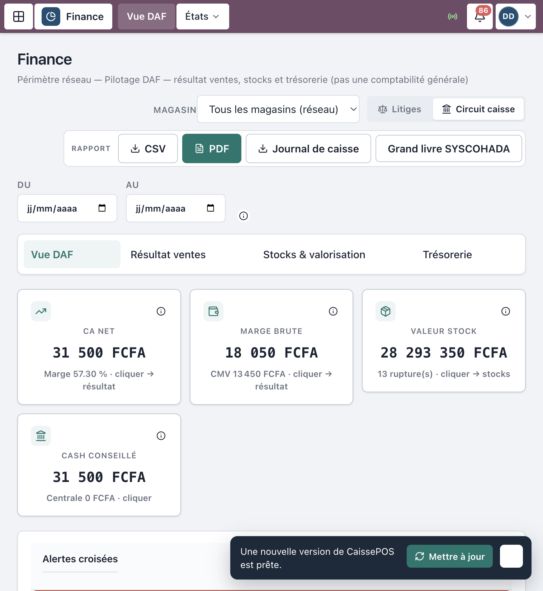
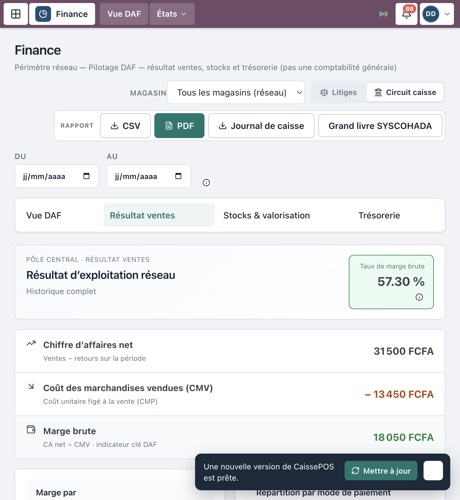
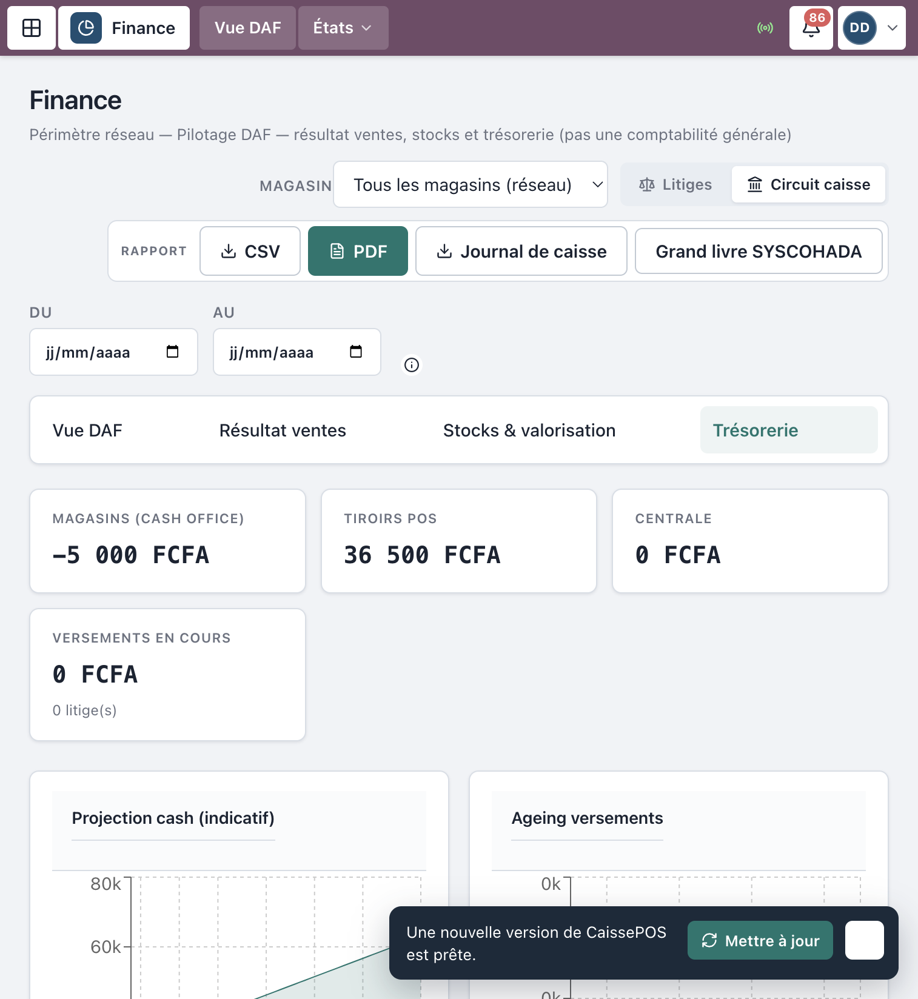
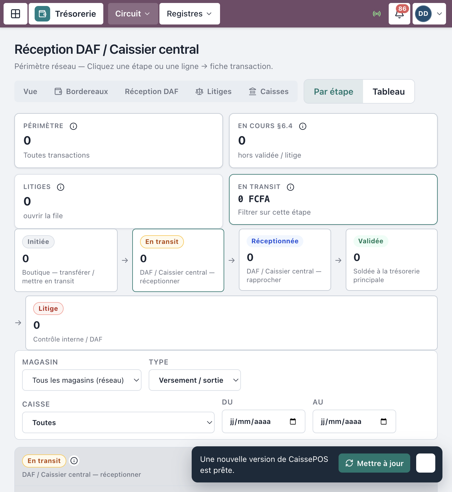
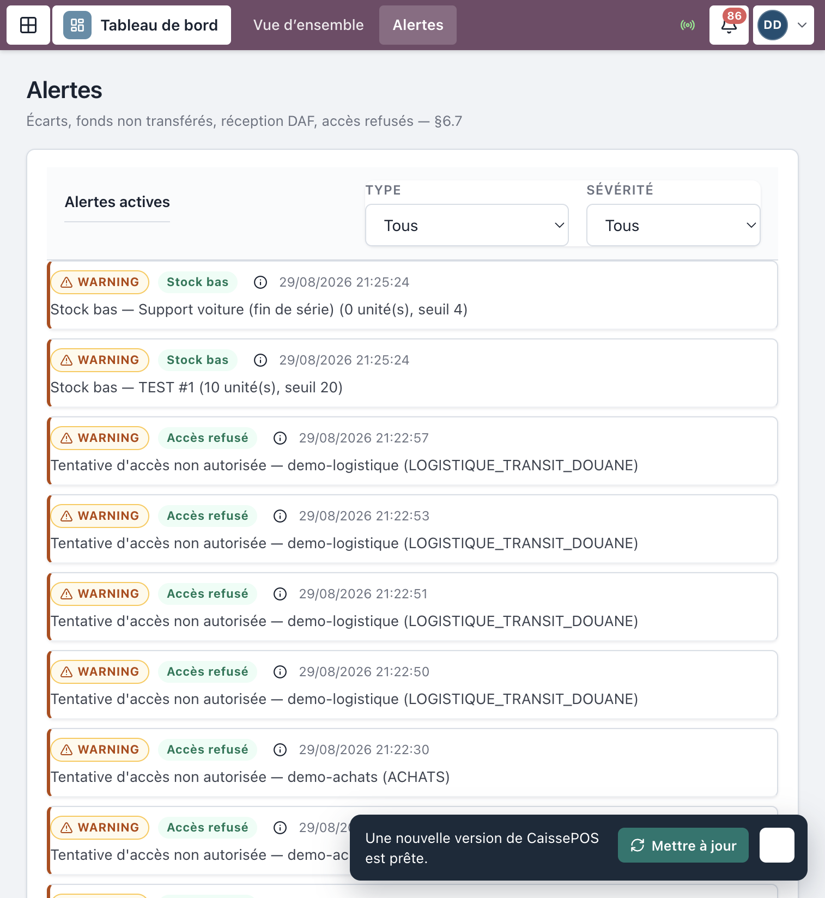

# Manuel d’utilisation — DAF & Finance

**Progiciel Caisses & CRM — MAJOR AUTO PARTS**  
Public : **DAF**, **Direction générale** (consultation), **Caissier central** (finance + trésorerie), **Contrôleur interne**  
Périmètre : cockpit financier, résultat, stocks valorisés, trésorerie réseau, validation niveau 2, litiges

> Captures réelles depuis l’application en production (`crm.majorautoparts.shop`, compte `demo-daf`). Les libellés correspondent exactement à l’interface.

---

## Table des matières

1. [Avant de commencer](#1-avant-de-commencer)
2. [Connexion](#2-connexion)
3. [Cockpit Finance](#3-cockpit-finance)
4. [Résultat et stocks](#4-résultat-et-stocks)
5. [Trésorerie réseau](#5-trésorerie-réseau)
6. [Validation des versements (niveau 2)](#6-validation-des-versements-niveau-2)
7. [Alertes et litiges](#7-alertes-et-litiges)
8. [Achats & comptabilité (aperçu)](#8-achats--comptabilité-aperçu)
9. [Ce que le DAF ne fait pas](#9-ce-que-le-daf-ne-fait-pas)
10. [Incidents fréquents](#10-incidents-fréquents)
11. [Comptes démo](#11-comptes-démo)

---

## 1. Avant de commencer

### Rôles

| Rôle | Accueil typique | Périmètre |
|------|-----------------|-----------|
| **DAF** | `/finance` | Réseau entier — validation niveau 2 |
| **Direction générale** | `/finance` | Consultation ; seuils exceptionnels |
| **Caissier central** | Finance / Trésorerie | Réception / rapprochement opérationnel |
| **Contrôleur interne** | Finance / Litiges / Audit | Lecture + régularisation litiges |

### Règle d’or

Le DAF **ne tient pas la caisse boutique**.  
Il **peut** réceptionner / valider les versements magasin → centrale (comme le Caissier central), et pilote le **cockpit** consolidé.

---

## 2. Connexion

1. `https://crm.majorautoparts.shop`
2. Compte DAF (ex. `demo-daf` en démo).
3. Accueil **Finance**.

*Figure 1 — Connexion*

---

## 3. Cockpit Finance

Route : `/finance`.

Onglets / sections typiques :

- **Vue** — synthèse réseau
- **Résultat** — CA net, CMV, marge brute, par boutique / mode de paiement
- **Stocks** — valeur, ruptures, sous-seuil, santé
- **Trésorerie** — soldes magasins / tiroirs / centrale, runway

Filtres éventuels : magasin / siège (périmètre).

Exports CSV disponibles selon boutons **Exporter** / icône téléchargement.

*Figure 2 — Cockpit Finance*

---

## 4. Résultat et stocks

### Résultat

- Suivre **CA net**, **marge brute**, **taux de marge**.
- Ventilation **par boutique** et **par mode de paiement**.
- Croiser avec le reporting ventes si besoin (`/ventes/reporting`).

### Stocks valorisés

- **Valeur totale**, **ruptures**, articles **sous seuil**.
- Santé stock et couverture médiane.
- Drill-down par boutique.

*Figure 3 — Indicateurs résultat ou stocks*

---

## 5. Trésorerie réseau

Depuis Finance (onglet trésorerie) ou menu **Trésorerie** (`/tresorerie`) :

- Soldes consolidés
- Pipeline des versements (§6.4)
- Ageing / retards
- Alertes trésorerie

Raccourcis : **Réception DAF**, **Litiges**, **Caisses**.

*Figure 4 — Trésorerie réseau*

---

## 6. Validation des versements (niveau 2)

Même workflow que le Caissier central (voir aussi le *Manuel trésorerie centrale*) :

1. **Trésorerie** → **Réception DAF**
2. Ouvrir un versement **En transit**
3. **Réceptionner (DAF / Caissier central)**
4. **Rapprocher** → **Validée** ou **Litige**

Le DAF intervient aussi pour les **seuils / validations de niveau 2** et le pilotage des retards.

*Figure 5 — Réception / validation*

---

## 7. Alertes et litiges

- Menu **Alertes** (`/alertes`) : écarts de caisse, versements en retard, accès refusés (§6.7).
- **Litiges** (`/litiges`) : **Régulariser → VALIDÉE** avec motif (DAF / Contrôle).

*Figure 6 — Alertes ou litiges*

---

## 8. Achats & comptabilité (aperçu)

Le DAF dispose aussi, selon menu :

| Domaine | Routes utiles |
|---------|----------------|
| Approbation commandes | `/achats/commandes`, `/achats/planning` |
| Factures fournisseur | `/achats/factures` |
| Comptabilité | `/finance/comptabilite` |

Détail opérationnel Achats : voir le *Manuel Stocks & Achats*.

---

## 9. Ce que le DAF ne fait pas

| Action | DAF |
|--------|-----|
| Encaisser en boutique | Non |
| Configurer le SI (zones, users) | Non (Responsable SI) |
| Admin campagnes CRM | Non (Responsable CRM) |
| Réceptionner / valider versements | **Oui** |
| Piloter résultat / stocks / cash | **Oui** |

---

## 10. Incidents fréquents

| Symptôme | Que faire |
|----------|-----------|
| Chiffres Finance vides | Vérifier période / filtre magasin-siège |
| Versement bloqué En transit | Traiter **Réception DAF** |
| Litige ouvert | Régulariser avec motif documenté |
| Export CSV indisponible | Droits rôle / période trop large |

---

## 11. Comptes démo

Mot de passe seed : `MotDePasse!123`

| Identifiant | Rôle |
|-------------|------|
| `demo-daf` | DAF |
| `demo-dg` | Direction générale |
| `demo-central` | Caissier central |
| `demo-controle` | Contrôleur interne |

---

## Checklist DAF (périodique)

- [ ] Cockpit **Finance** (résultat, stocks, cash)  
- [ ] File **Réception DAF** à jour  
- [ ] **Litiges** et **Alertes** traités  
- [ ] Approbations achats en attente  
- [ ] Exports / reporting pour la Direction  

---

*Document couvrant le pilotage DAF (§4, §6.2, §6.4, reporting).*  
*MAJOR AUTO PARTS · CaissePOS*
