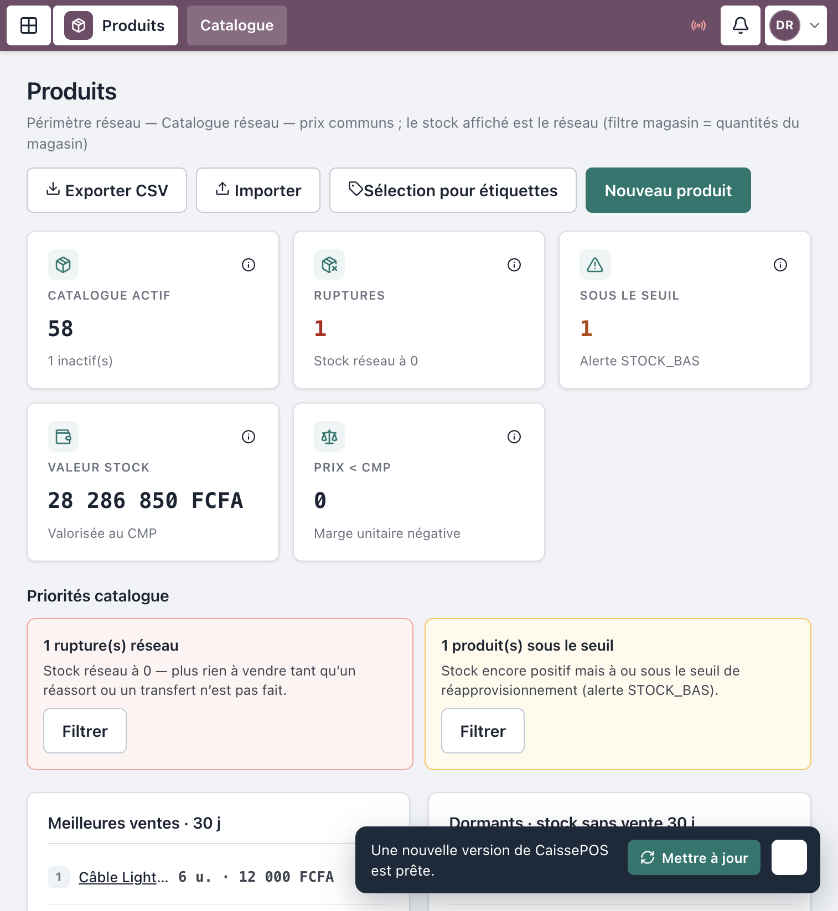
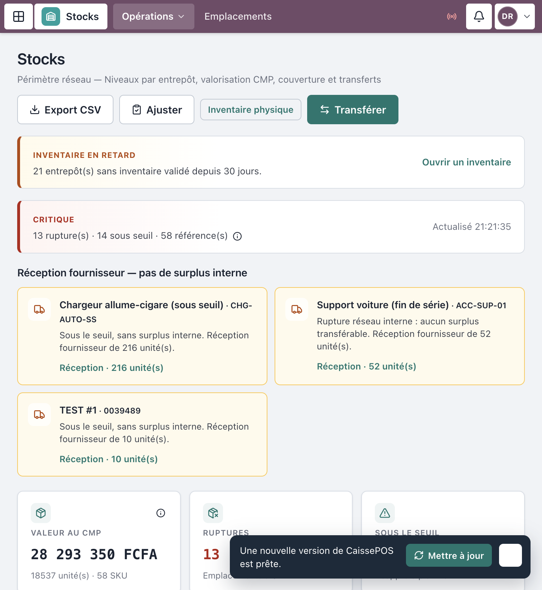
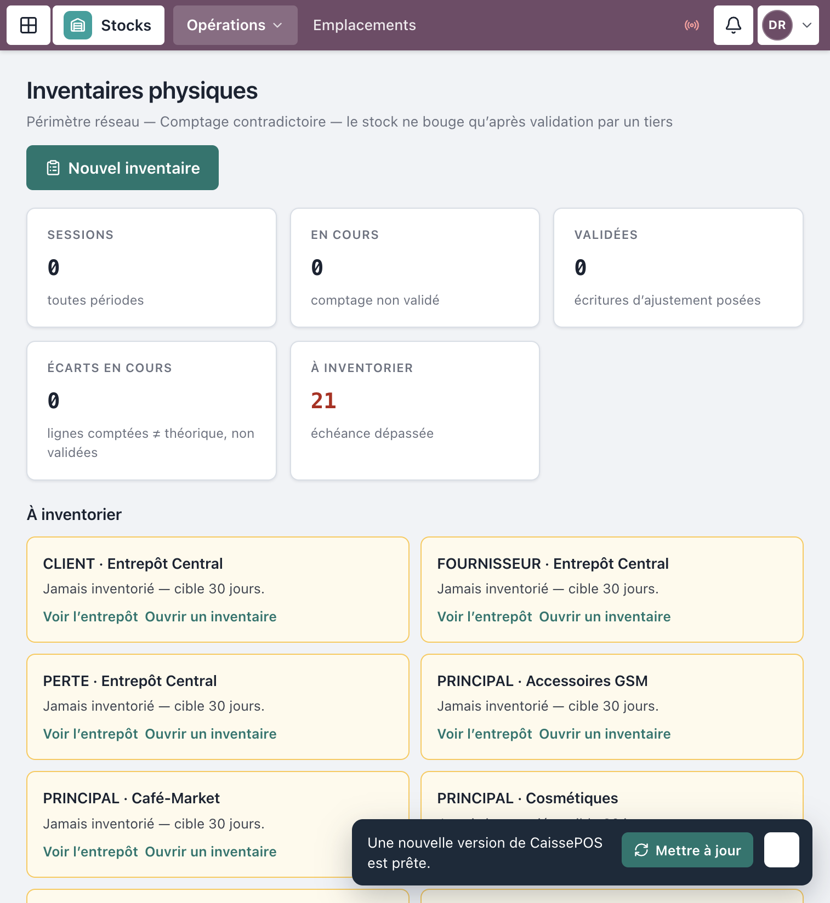
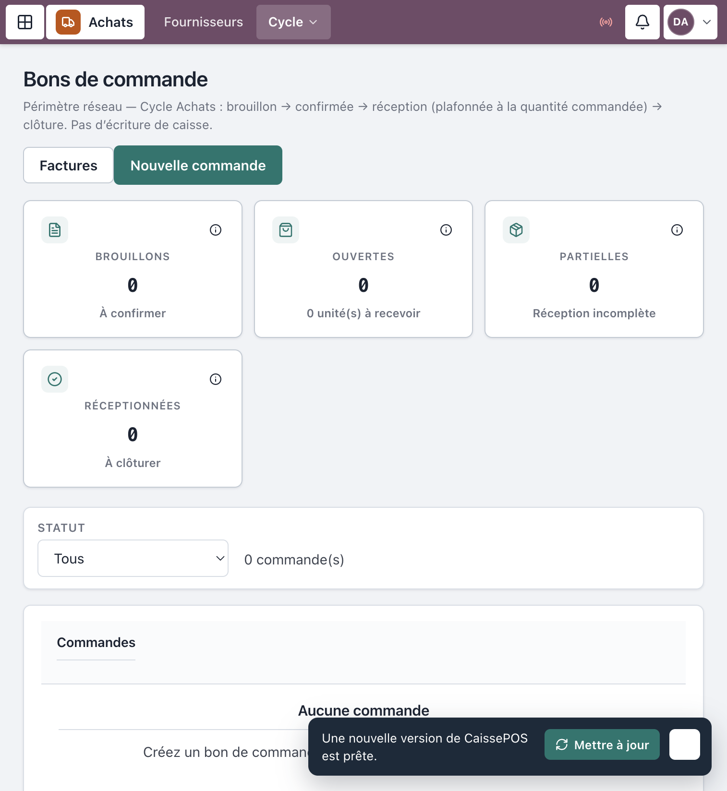
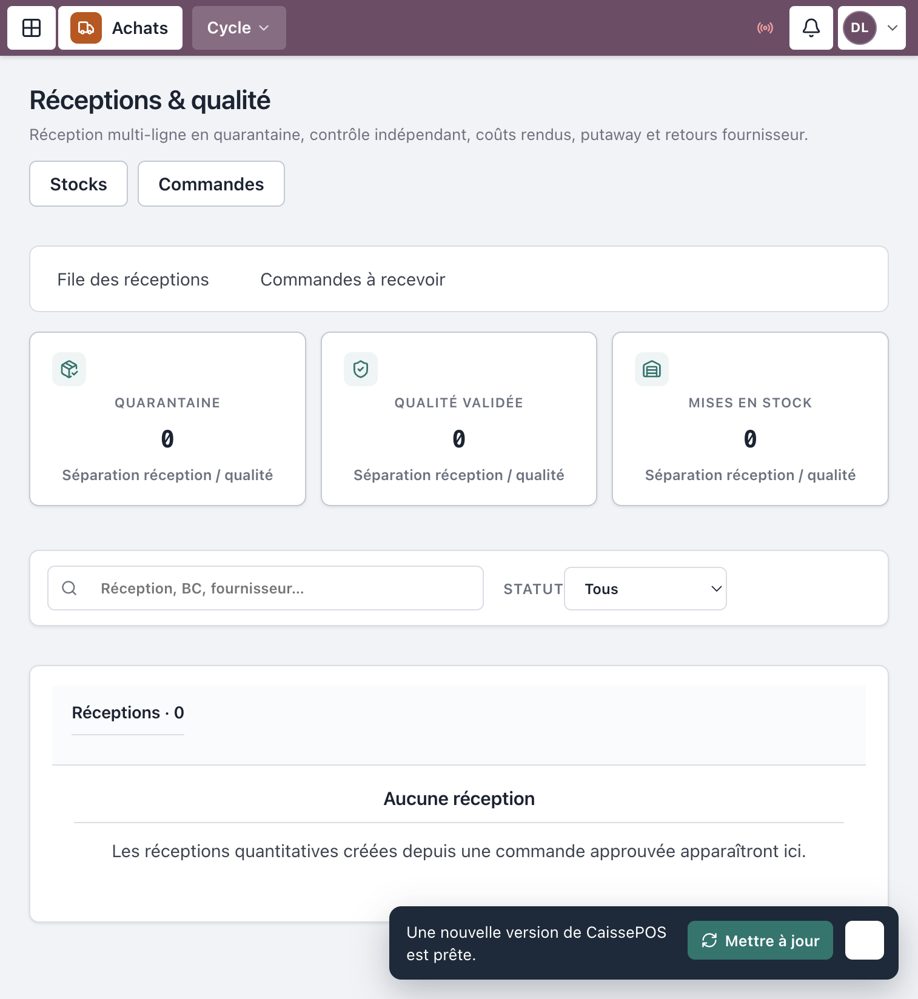

# Manuel d’utilisation — Stocks & Achats

**Progiciel Caisses & CRM — MAJOR AUTO PARTS**  
Public : **Achats**, **Logistique**, **Qualité / Stocks**, **RAF**, **Resp. SI / boutique** (selon étapes)  
Périmètre : catalogue, stocks, inventaires, fournisseurs, commandes, réceptions, factures fournisseur

> Captures réelles depuis l’application en production (`crm.majorautoparts.shop`). Les libellés correspondent exactement à l’interface.

---

## Table des matières

1. [Avant de commencer](#1-avant-de-commencer)
2. [Connexion](#2-connexion)
3. [Catalogue produits](#3-catalogue-produits)
4. [Stocks et mouvements](#4-stocks-et-mouvements)
5. [Inventaires physiques](#5-inventaires-physiques)
6. [Fournisseurs et commandes](#6-fournisseurs-et-commandes)
7. [Réceptions et qualité](#7-réceptions-et-qualité)
8. [Factures fournisseur](#8-factures-fournisseur)
9. [Séparation des tâches Achats](#9-séparation-des-tâches-achats)
10. [Incidents fréquents](#10-incidents-fréquents)
11. [Comptes démo](#11-comptes-démo)

---

## 1. Avant de commencer

Le circuit P2P sépare volontairement les rôles :

| Étape | Qui |
|-------|-----|
| Demande / commande | Achats (± boutique) |
| Approbation | DAF / Direction |
| Réception quantitative | **Logistique** |
| Qualité / mise en stock | **Qualité / Stocks** |
| Facture / matching | **RAF / Comptable** |
| Paiement | Trésorerie / DAF (hors POS) |

Une même personne ne doit pas enchaîner toutes les validations (contrôle interne).

---

## 2. Connexion

1. Se connecter sur `https://crm.majorautoparts.shop` avec le compte du métier (Achats, Logistique, Qualité…).
2. Accueil selon profil : **Commandes**, **Réceptions**, **Produits**, etc.

*Figure 1 — Connexion*

---

## 3. Catalogue produits

Menu **Produits** (`/produits`).

1. Rechercher / filtrer.
2. **Nouveau produit** → **Créer** *(SI / DG / DAF selon droits)*.
3. Ou **Importer** / **Importer CSV / Excel**.
4. Ouvrir une fiche `/produits/:id` pour le détail.

*Figure 2 — Catalogue produits*

---

## 4. Stocks et mouvements

Menu **Opérations** → **Stocks** (`/stocks`).

Actions fréquentes :

- **Ajuster** → **Enregistrer l’ajustement** *(ajustement libre souvent réservé SI / DG)*
- **Transférer** → **Confirmer le transfert**
- Lien **Réception** vers le module achats
- **Mouvements** (`/stocks/operations`) : **Nouveau bon** → **Créer le brouillon**

*Figure 3 — Stocks*

---

## 5. Inventaires physiques

Menu **Opérations** → **Inventaires physiques** (`/inventaires`).

1. **Ouvrir un inventaire**.
2. **Figer le théorique et compter** (ou **Reprendre le comptage**).
3. Saisir les quantités comptées ligne à ligne.
4. Un **tiers** valide : **Valider et ajuster le stock**.
5. **Annuler la session** si l’inventaire est abandonné.

> Le compteur et le validateur ne doivent pas être la même personne (règle UI « tiers »).

*Figure 4 — Inventaire physique*

---

## 6. Fournisseurs et commandes

### Fournisseurs

Menu **Fournisseurs** (`/fournisseurs`) → **Nouveau fournisseur** → **Créer**.

Sur la fiche : **Créer un bon de commande**, **Enregistrer une réception**, **Enregistrer un paiement** (selon droits).

### Planning & commandes

| Écran | Route |
|-------|-------|
| Planning & sourcing | `/achats/planning` — **Nouvelle demande**, **Soumettre**, **Approuver** |
| Bons de commande | `/achats/commandes` — **Nouvelle commande** |

Sur un bon (`/achats/commandes/:id`) : **Soumettre** → **Approuver** → **Confirmer** → **Réceptionner** → **Clôturer** / **Répartir vers boutiques**.

*Figure 5 — Commandes d’achat*

---

## 7. Réceptions et qualité

Menu **Cycle** → **Réceptions & qualité** (`/achats/receptions`).

1. Logistique : réception **quantitative**.
2. Qualité : **Décider la qualité**.
3. **Allouer un coût** (si applicable).
4. **Mettre en stock** (putaway).
5. **Préparer un retour** en cas de non-conformité.

*Figure 6 — Réceptions & qualité*

---

## 8. Factures fournisseur

Menu **Cycle** → **Factures & matching** (`/achats/factures`).

1. Sélectionner les **Réceptions à facturer**.
2. **Créer le brouillon** (RAF).
3. Matching / suite comptable dans **Finance / Comptabilité** selon procédure.

---

## 9. Séparation des tâches Achats

| Action | Achats | Logistique | Qualité | RAF | DAF/DG |
|--------|--------|------------|---------|-----|-------|
| Créer commande | Oui | — | — | — | Lecture / approbation |
| Approuver | — | — | — | — | Oui |
| Réception quantitative | — | Oui | — | — | — |
| Décision qualité / stock | — | — | Oui | — | — |
| Facture brouillon | — | — | — | Oui | — |

---

## 10. Incidents fréquents

| Symptôme | Que faire |
|----------|-----------|
| Pas de bouton **Approuver** | Compte Achats ≠ DAF/DG |
| Impossible de **Mettre en stock** | Étape qualité non faite ou mauvais rôle |
| Inventaire non validable | Même utilisateur que le compteur — faire valider par un tiers |
| Produit absent du POS | Vérifier actif + stock boutique / emplacement |

---

## 11. Comptes démo

Mot de passe seed : `MotDePasse!123`

| Identifiant | Rôle |
|-------------|------|
| `demo-achats` | Responsable achats |
| `demo-logistique` | Logistique / Transit |
| `demo-qualite` | Qualité / Stocks |
| `demo-raf` | RAF / Comptable |
| `demo-respsi` | Catalogue / structure |
| `demo-daf` | Approbations |

---

## Checklist

- [ ] Référentiel produits à jour  
- [ ] Commandes soumises puis approuvées  
- [ ] Réceptions quantitatives + qualité bouclées  
- [ ] Stocks ajustés / inventaires validés par un tiers  
- [ ] Factures fournisseur matchées  

---

*Document couvrant stocks, inventaires et cycle achats P2P.*  
*MAJOR AUTO PARTS · CaissePOS*
