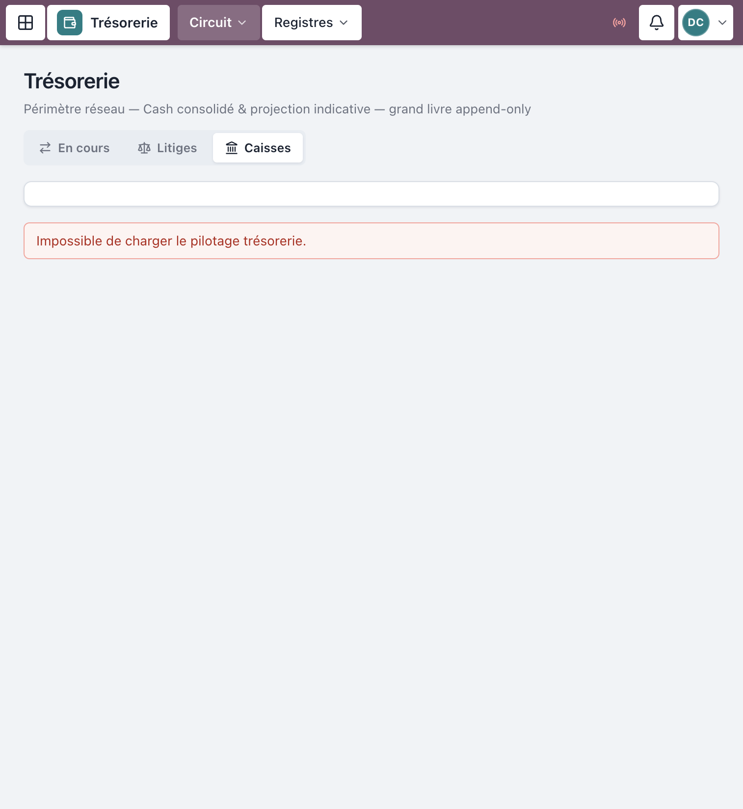
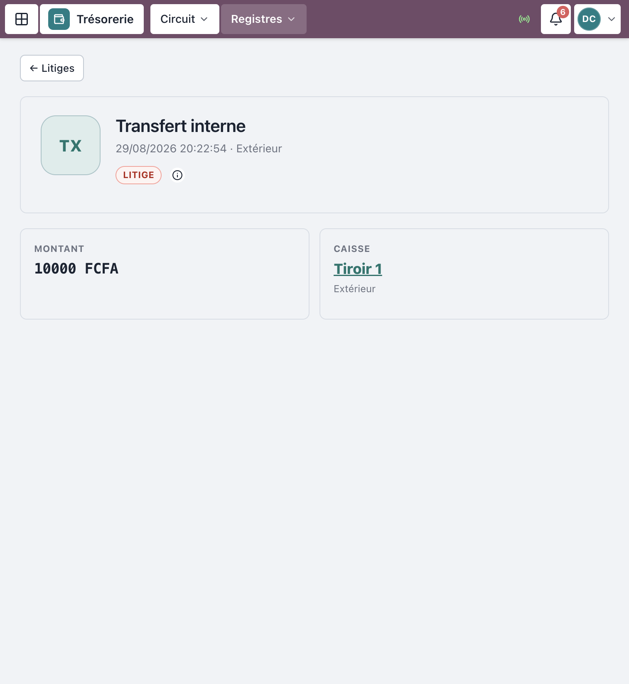
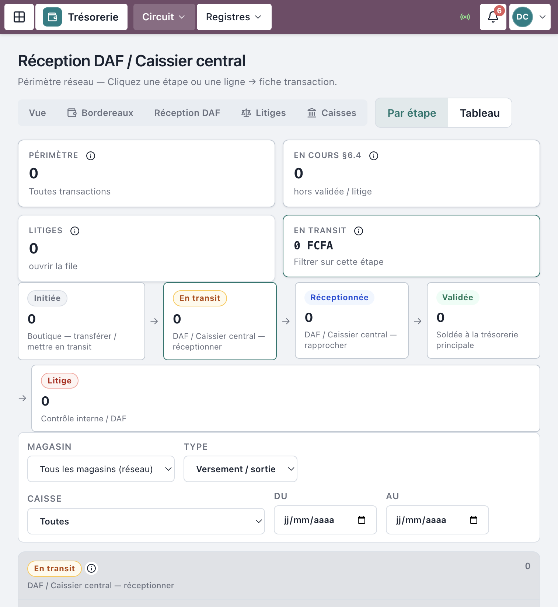
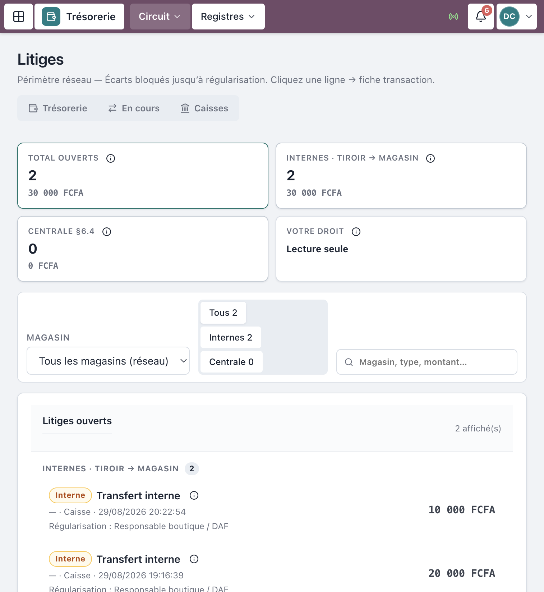

# Manuel d’utilisation — Trésorerie centrale

**Progiciel Caisses & CRM — MAJOR AUTO PARTS**  
Public : **Caissier central / Trésorier** et **DAF** (réception / validation)  
Périmètre : réceptionner les versements magasin → centrale, rapprocher, traiter les litiges (§6.4)

> Captures réelles depuis l’application en production (`crm.majorautoparts.shop`, comptes démo centrale / DAF). Les libellés correspondent exactement à l’interface.

---

## Table des matières

1. [Avant de commencer](#1-avant-de-commencer)
2. [Connexion](#2-connexion)
3. [Vue d’ensemble trésorerie](#3-vue-densemble-trésorerie)
4. [Réceptionner un versement](#4-réceptionner-un-versement)
5. [Rapprocher (valider ou litige)](#5-rapprocher-valider-ou-litige)
6. [Litiges](#6-litiges)
7. [Circuit des fonds (rappel)](#7-circuit-des-fonds-rappel)
8. [Ce que la centrale peut / ne peut pas faire](#8-ce-que-la-centrale-peut--ne-peut-pas-faire)
9. [Incidents fréquents](#9-incidents-fréquents)
10. [Comptes démo](#10-comptes-démo)

---

## 1. Avant de commencer

### Rôles concernés

| Rôle | Accès principal | Peut faire |
|------|-----------------|------------|
| **Caissier central** | Trésorerie / Réception DAF | **Réceptionner** et **Rapprocher** les `SORTIE_FONDS` |
| **DAF** | Finance + Trésorerie | Idem + pilotage / validation niveau 2 |
| **Contrôleur interne** | Litiges / Audit | **Régulariser** un litige (pas réceptionner en routine) |

### Prérequis côté boutique

Avant votre intervention, la boutique a déjà :

1. Initié le versement → statut **Initiée**
2. Mis le versement **En transit** (responsable boutique ou convoyeur)

Sans **En transit**, vous n’avez rien à réceptionner.

### Règle d’or (séparation des tâches)

La boutique **initie** et **met en transit**.  
**Seul** le Caissier central ou le DAF **réceptionne** et **valide** (rapproche).  
Ce n’est pas un simple masquage d’écran : l’API refuse (403) toute tentative hors rôle.

---

## 2. Connexion

1. Ouvrir `https://crm.majorautoparts.shop` (ou l’URL de votre environnement).
2. Saisir votre **Identifiant** et **Mot de passe**.
3. Valider le widget anti-bot si demandé, puis **Se connecter**.
4. Accueil typique : **Finance** ou **Trésorerie**.


*Figure 1 — Connexion*

---

## 3. Vue d’ensemble trésorerie

Menu **Trésorerie** → **Vue d’ensemble** (`/tresorerie`).

Vous y voyez notamment :

- **Cash consolidé**, soldes **Magasins / tiroirs**, **Centrale**
- Pipeline des versements : **Initiée** · **En transit** · **Réceptionnée** · **Validée** · **Litige**
- Alertes (retards > 24 h, litiges ouverts)
- Raccourcis : **Réception DAF**, **Litiges**, **Caisses**



*Figure 2 — Vue d’ensemble trésorerie*

Navigation utile sur les listes circuit :

**Vue** · **Bordereaux** · **Réception DAF** · **Litiges** · **Caisses**

---

## 4. Réceptionner un versement

### 4.1 Ouvrir la file à réceptionner

1. Menu **Trésorerie** → **Réception DAF** (`/tresorerie/reception`).
2. La liste est filtrée par défaut sur les sorties de fonds **En transit**.
3. Cliquer la ligne du versement concerné → fiche transaction.


*Figure 3 — File des versements en transit*

### 4.2 Action Réceptionner

Sur la fiche (`/transactions/:id`) :

1. Relire le montant déclaré et le bordereau.
2. Vérifier physiquement les fonds reçus (procédure magasin).
3. Cliquer **Réceptionner (DAF / Caissier central)**.
4. Statut → **Réceptionnée**.

Bannière typique : *« À réceptionner par le DAF ou le Caissier central — {montant} FCFA. »*



*Figure 4 — Fiche transaction : réception*

> Options utiles : **Imprimer le bordereau**.

---

## 5. Rapprocher (valider ou litige)

Une fois **Réceptionnée** :

1. Cliquer **Rapprocher**.
2. Dans la modale **Rapprochement**, contrôler le champ **Montant reçu** (prérempli = déclaré).
3. Soumettre **Rapprocher**.

| Situation | Résultat |
|-----------|----------|
| Montant reçu = déclaré | Statut **Validée** |
| Montant reçu ≠ déclaré | Statut **Litige** |

Il n’y a **pas** de bouton « Litige » séparé : l’écart au rapprochement ouvre le litige.



*Figure 5 — Modale de rapprochement*

Stepper du circuit sur la fiche :

**Transfert initié** → **En transit** → **Réception DAF** → **Validée**

---

## 6. Litiges

Menu **Trésorerie** → **Litiges** (`/litiges`).

Filtres utiles : **Tous** / **Internes** (tiroir → magasin) / **Centrale** (§6.4).

### Régularisation (Contrôle interne / DAF)

1. Ouvrir le litige → fiche transaction.
2. Section **Régularisation** : saisir **Montant retenu** et **Motif (obligatoire)**.
3. Cliquer **Régulariser → VALIDÉE**.



*Figure 6 — Liste des litiges*

---

## 7. Circuit des fonds (rappel)

```
Initiée → En transit → Réceptionnée → Validée
                   ↘ Litige (bloqué jusqu’à régularisation)
```

| Statut | Qui agit |
|--------|----------|
| **Initiée** | Boutique |
| **En transit** | Responsable boutique / Convoyeur |
| **Réceptionnée** | **Caissier central / DAF** |
| **Validée** | **Caissier central / DAF** (rapprochement OK) |
| **Litige** | Arbitrage Contrôle interne / DAF |

---

## 8. Ce que la centrale peut / ne peut pas faire

| Action | Centrale / DAF | Boutique |
|--------|----------------|----------|
| Encaisser une vente POS | Non (lecture éventuelle) | Oui |
| Initier un versement | Non | Oui |
| Mettre en transit | Non | Resp. / Convoyeur |
| **Réceptionner** | **Oui** | **Non** |
| **Rapprocher / Valider** | **Oui** | **Non** |
| Régulariser litige §6.4 | DAF / Contrôle | Non |

---

## 9. Incidents fréquents

| Symptôme | Que faire |
|----------|-----------|
| File Réception DAF vide | Vérifier que la boutique a bien mis **En transit** |
| Bouton **Réceptionner** absent | Mauvais rôle, ou statut ≠ En transit |
| Litige inattendu | Revoir le **Montant reçu** saisi au rapprochement |
| 403 à l’action | Compte hors `CAISSIER_CENTRAL` / `DAF` — contacter le SI |
| Retard > 24 h | Traiter depuis les alertes trésorerie / pipeline |

---

## 10. Comptes démo

Mot de passe seed : `MotDePasse!123` *(pas en production live)*

| Identifiant | Rôle | Usage |
|-------------|------|--------|
| `demo-central` | Caissier central | Réception / rapprochement |
| `demo-daf` | DAF | Idem + finance |
| `demo-controle` | Contrôleur interne | Litiges / audit (pas réception routine) |

---

## Checklist quotidienne (centrale)

- [ ] Consulter **Trésorerie** (retards, litiges)  
- [ ] Traiter la file **Réception DAF** (tous les **En transit**)  
- [ ] **Réceptionner** puis **Rapprocher** chaque bordereau  
- [ ] Traiter les **Litiges** ouverts avec motif  
- [ ] Conserver / imprimer les bordereaux utiles  

---

*Document couvrant la machine à états §6.4 côté centrale et la séparation des tâches §6.2.*  
*MAJOR AUTO PARTS · CaissePOS*
